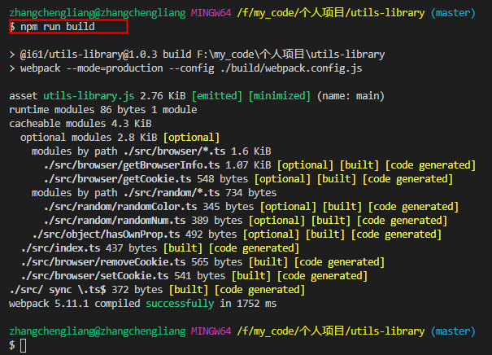
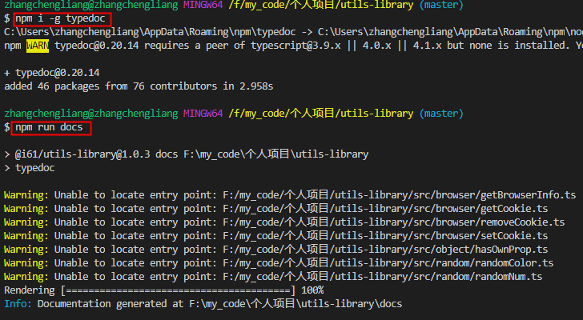
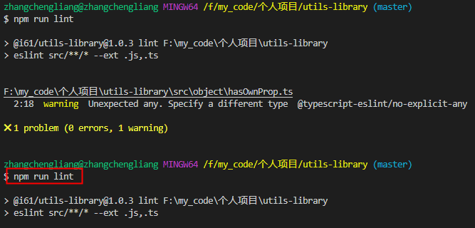
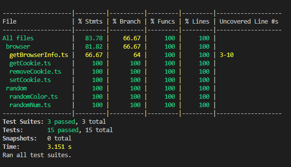

### 待开发：
1. src/index.ts 每次加新接口，都import 新接口。解决：自动导入
   * 已解决：通过webpack的api: require.context. 需要先安装声明包：@types/webpack-env
2. doc说明文档 美化生成？
   * 已解决：typedoc
3. 推包
   * 已解决  output.libraryExport属性。src目录以文件名为函数Key，导出为 value

### package.json脚本
```
  "scripts": {
    "start": "webpack serve --mode=development --config ./example/webpack.config.js",
    "build": "webpack --mode=production --config ./build/webpack.config.js",
    "docs": "typedoc",
    "lint": "eslint src/**/* --ext .js,.ts",
    "jest": "jest --coverage",
    "next": "npm run build && npm set registry http://verdaccio.61info.com && npm version prerelease --preid=next && npm publish --tag=next && git push",
    "patch": "npm run build && npm set registry http://verdaccio.61info.com && npm version patch && npm publish && git push",
    "minor": "npm run build && npm set registry http://verdaccio.61info.com && npm version minor && npm publish && git push",
    "major": "npm run build && npm set registry http://verdaccio.61info.com && npm version major && npm publish && git push"
  }
```
* npm run start: 启动example目录下的demo项目

* npm run build: 打包src目录。入口是src/index.ts

* npm run docs: 自动生成文档, 目录为docs。配置文件为typedoc.json

* npm run lint: 代码检查。可检查ts文件。配置文件为.eslintrc.js

* npm run jest: 测试。配置文件为jest.config.js

* npm run next: 发布next分支(测试环境用)
   * npm run patch: 发布子版本
   * npm run minor: 发布次版本号
   * npm run major: 发布主版本号